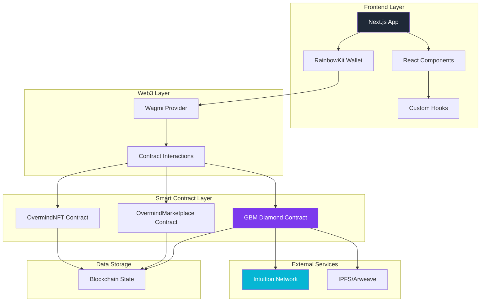
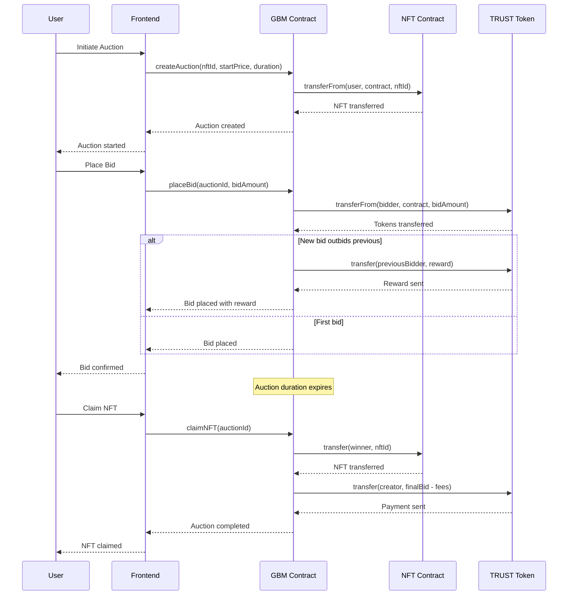
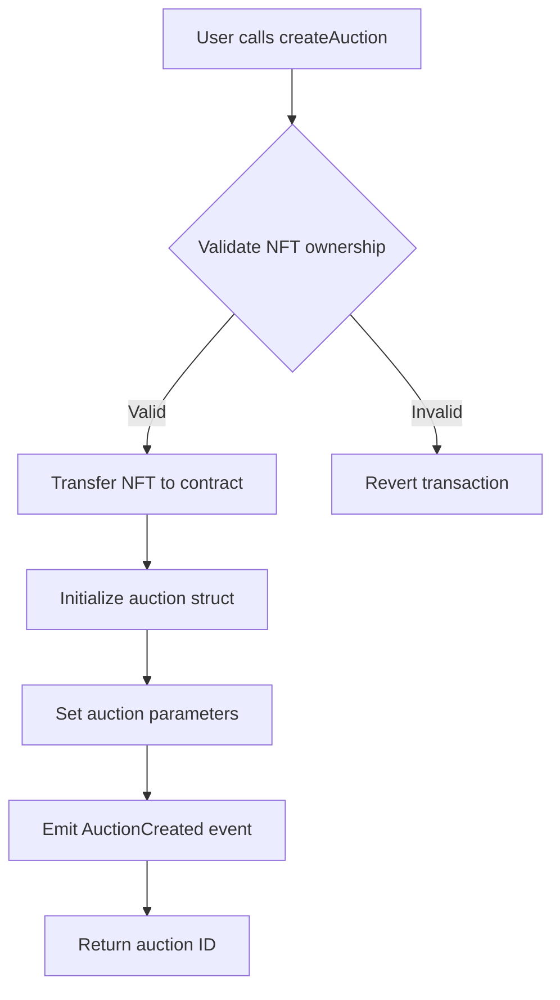
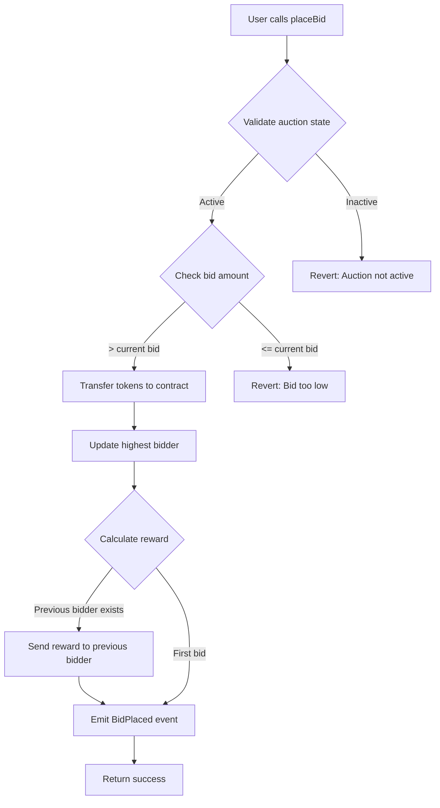
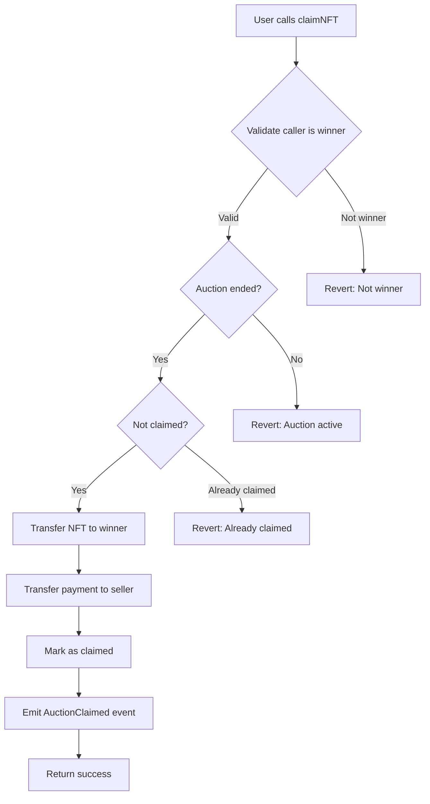
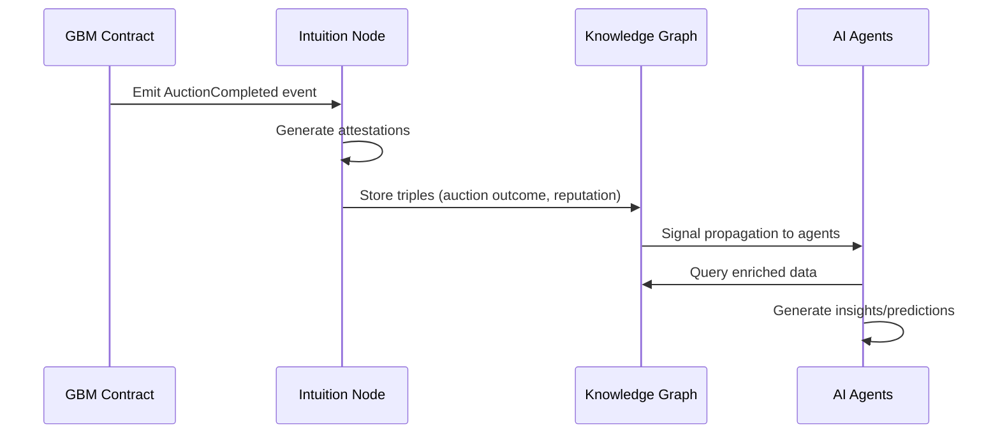

# Overmind Gallery - Architecture Documentation

## Overview

The Overmind Gallery is a Web3 NFT marketplace that implements the **GBM (Gotta-Be-More) auction mechanism** from Aavegotchi. This sophisticated auction system replaces traditional buy/sell mechanics with dynamic, competition-driven pricing that rewards active participation.

## System Architecture

### High-Level Architecture



### GBM Auction Flow



## GBM Auction Mechanism

### Core Components

#### 1. GBM Diamond Contract
The main auction contract using the Diamond pattern for upgradeability:

- **GBMFacet**: Core auction logic (bidding, claiming, closing)
- **GBM_TRUSTFacet**: TRUST token specific functions
- **SettingsFacet**: Configuration management
- **OwnershipFacet**: Access control

#### 2. Auction Parameters
```solidity
struct Auction {
    uint256 auctionId;
    address nftContract;
    uint256 nftId;
    address seller;
    address highestBidder;
    uint256 highestBid;
    uint256 startingBid;
    uint256 endTime;
    bool claimed;
    AuctionState state;
}
```

#### 3. Dynamic Reward System
When a bidder is outbid, they receive a reward calculated as:
```
reward = min(10%, relative_increase) × new_bid_amount
```

Where `relative_increase = (new_bid - old_bid) / old_bid`

### Contract Interactions

#### Auction Creation Flow


#### Bidding Flow


#### Claiming Flow


## Data Structures

### Key Storage Layout (AppStorage.sol)
```solidity
struct AppStorage {
    // GBM Auctions
    mapping(uint256 => Auction) auctions;
    mapping(address => uint256[]) userAuctions;
    mapping(uint256 => Bid[]) auctionBids;

    // Configuration
    GBMSettings settings;

    // ERC721 Integration
    mapping(address => bool) supportedNFTContracts;
}
```

### Auction States
```solidity
enum AuctionState {
    Active,     // Auction is running
    Ended,      // Time expired
    Cancelled,  // Seller cancelled
    Claimed     // NFT claimed by winner
}
```

## Integration Points

### Frontend Integration
- **useGBMAuction hook**: Manages auction state and interactions
- **useOvermindNFT hook**: NFT ownership and metadata
- **useOvermindMarketplace hook**: Legacy marketplace functions

### Intuition Network Integration
The GBM system integrates with the Intuition Knowledge Graph to:
- Track auction outcomes and reputation
- Store provenance data for NFTs
- Enable AI-driven insights on market trends

#### Intuition Integration Details

##### Data Structure Plan (Atoms, Triples, Signal, Schemas)

**Atoms to create:**
- `AuctionResult`: Result of an auction (winner, final_price, participants)
- `CreatorReputation`: Reputation score based on sales/attestations
- `BidHistory`: History of bids with timestamps
- `NFTProvenance`: Complete ownership chain of an NFT

**Triples to define:**
- `creator:reputation_score`: numeric value (0-100)
- `auction:outcome`: "successful"/"failed"/"cancelled"
- `bidder:participation_count`: number of auctions participated
- `nft:provenance_chain`: array of ownership transfers
- `auction:final_price`: TRUST amount in wei
- `creator:sales_volume`: total TRUST earned

**Attestations to write:**
- Successful sale: `(seller_did, buyer_did, nft_id, final_price, timestamp, auction_id)`
- Failed auction: `(auction_id, reason, participants_affected[], timestamp)`
- Creator reputation: `(creator_did, score, factors: {volume, success_rate, avg_price})`
- Bid participation: `(bidder_did, auction_id, bid_amount, position, timestamp)`

##### Knowledge Graph Enrichment Process

**How auction data feeds the Knowledge Graph:**
1. **Auction Creation**: Creates `AuctionResult` atom with initial metadata
2. **Bid Placement**: Updates `BidHistory` and participant counts
3. **Auction Completion**: Generates final attestations and reputation updates
4. **Signal Propagation**: Auction activity creates ripples in the Intuition network

**AI Consumption Patterns:**
- Agents can query "top_creators_by_reputation" for trending artists
- Market analysis AI analyzes "price_trends_by_category"
- Recommendation systems use "bidder_behavior_patterns"
- Risk assessment uses "auction_success_rates"

##### Integration Flow



##### API Integration Points

**Contract Hooks:**
- `afterAuctionCreated()`: Initialize auction atoms
- `afterBidPlaced()`: Update bid history triples
- `afterAuctionClaimed()`: Generate final attestations

**Frontend Integration:**
- Display creator reputation scores from Intuition
- Show AI-powered price suggestions
- Enable social features based on network connections

**Data Synchronization:**
- Real-time updates via WebSocket to Intuition nodes
- Batch attestation submission for gas efficiency
- Conflict resolution for concurrent auction states

### Smart Contract Dependencies
- **Diamond Standard**: For modular contract architecture
- **ERC721**: NFT standard implementation
- **ERC20**: TRUST token for bidding
- **OpenZeppelin**: Security and utility libraries

## Security Considerations

### Access Control
- Only verified creators can list NFTs
- Auction parameters validated on creation
- Bid amounts checked against minimum increases

### Fund Safety
- Tokens held in contract during auction
- Automatic refunds for outbid participants
- Platform fees deducted before seller payment

### Upgradeability
- Diamond pattern allows facet upgrades
- Timelock for critical parameter changes
- Emergency pause functionality

## Performance Optimizations

### Gas Efficiency
- Batch operations for multiple bids
- Optimized storage layouts
- Efficient reward calculations

### Frontend Optimizations
- Real-time bid updates via WebSocket
- Cached auction data
- Lazy loading of bid history

## Future Enhancements

### Planned Features
- **Multi-token support**: Accept different ERC20 tokens for bidding
- **Dutch auction fallback**: Automatic price reduction if no bids
- **Flash loan integration**: Allow leveraged bidding
- **Cross-chain auctions**: Support for multiple blockchains

### Intuition AI Integration
- **Predictive pricing**: AI-driven starting price suggestions
- **Market analysis**: Trend prediction and insights
- **Automated bidding**: Smart contract-based bidding strategies

---

*This architecture documentation reflects the transition from simple marketplace to sophisticated GBM auction system, enabling dynamic pricing through competitive bidding.*